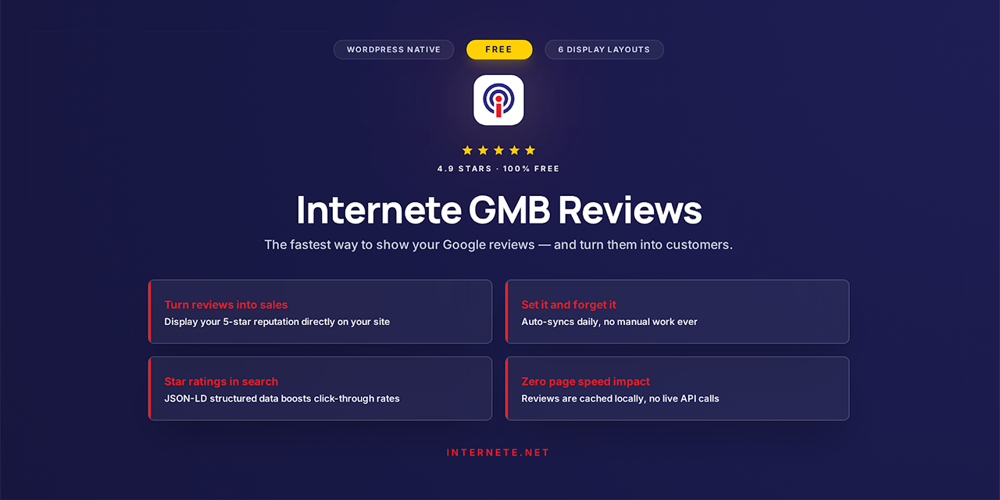

# Internete GMB Reviews



**Display your Google Business Profile reviews beautifully on any WordPress site — without slowing it down.**

Reviews are synced once and stored locally in your WordPress database. No live API calls on page load. Zero impact on page speed.

---

## Features

- **6 Display Layouts** — Grid, List, Horizontal Scroll, Carousel, Compact, Paginated
- **3 Card Styles** — Default, Minimal, Detailed
- **Google Badge** — Authentic star rating badge (horizontal or vertical)
- **SEO Structured Data** — JSON-LD rich snippets for Google search star ratings
- **Auto Sync** — Daily sync at 4:00 AM via WP-Cron. Set it and forget it.
- **Review Accumulation** — Old reviews are never deleted. Your library grows over time.
- **Mobile Responsive** — Works on all screen sizes
- **GDPR Friendly** — No visitor data collected, no cookies set on the frontend
- **Zero Bloat** — No page builders required, no tracking scripts, no external dependencies

---

## Installation

### From WordPress.org (Recommended)
1. Go to **Plugins → Add New** in your WordPress admin
2. Search for **"Internete GMB Reviews"**
3. Click **Install Now**, then **Activate**

### Manual Installation
1. Download `internete-gmb-reviews.zip` from the [latest release](https://github.com/internetebiz/internete-gmb-free/releases/latest)
2. Go to **Plugins → Add New → Upload Plugin**
3. Upload the zip and activate

---

## Setup

1. Go to **Settings → GMB Reviews**
2. Enter your **Google Place ID** — [Find it here](https://developers.google.com/maps/documentation/javascript/examples/places-placeid-finder)
3. Enter your **Google API Key** — [Get one here](https://console.cloud.google.com/) (enable *Places API*)
4. Click **Save Settings**, then **Fetch Reviews Now**
5. Add `[internete_gmb_reviews]` to any page, post, or widget

---

## Shortcode Usage

Basic:
```
[internete_gmb_reviews]
```

Carousel on a homepage:
```
[internete_gmb_reviews layout="carousel" limit="5" autoplay="yes" show_date="no"]
```

Grid of 5-star reviews only:
```
[internete_gmb_reviews layout="grid" columns="3" limit="6" min_rating="5" show_date="no"]
```

Vertical badge for a sidebar:
```
[internete_gmb_reviews show_reviews="no" badge_layout="vertical"]
```

### All Parameters

| Parameter | Default | Options | Description |
|---|---|---|---|
| `limit` | `3` | Any number | Number of reviews to display |
| `min_rating` | `0` | 1–5 | Minimum star rating to show |
| `layout` | `grid` | `grid`, `list`, `horizontal`, `carousel`, `compact`, `paginated` | Display layout |
| `columns` | `3` | 1–6 | Columns in grid layout |
| `card_style` | `default` | `default`, `minimal`, `detailed` | Card visual style |
| `badge_layout` | `horizontal` | `horizontal`, `vertical` | Badge orientation |
| `show_badge` | `yes` | `yes`, `no` | Show the star rating badge |
| `show_reviews` | `yes` | `yes`, `no` | Show review cards |
| `show_date` | `yes` | `yes`, `no` | Show reviewer date |
| `show_see_all` | `yes` | `yes`, `no` | Show "See All Reviews" link |
| `max_text_length` | `200` | Any number | Truncate review text at N characters |
| `autoplay` | `yes` | `yes`, `no` | Carousel autoplay |
| `autoplay_speed` | `4000` | Milliseconds | Carousel slide interval |
| `show_navigation` | `yes` | `yes`, `no` | Carousel prev/next arrows |
| `show_dots` | `yes` | `yes`, `no` | Carousel dot indicators |

---

## Requirements

- WordPress 5.8 or higher
- PHP 7.4 or higher
- Google API Key with Places API enabled
- Google Place ID for your business

---

## Pro Version

Need more than 5 reviews, automatic sync without an API key, or the ability to reply to reviews from WordPress?

**[GMB Reviews Pro](https://internete.net/gmb-reviews-pro)** adds:

- Google OAuth — no API key required
- Up to 500 reviews synced (vs. 5 in free)
- Reply to Google reviews from your WP admin
- Multi-location management
- Review moderation (hide, feature, flag)
- Flexible sync scheduling
- CSV & JSON export
- Full sync history and error logs

[Learn more →](https://internete.net/gmb-reviews-pro)

---

## License

GPLv2 or later. See [LICENSE](https://www.gnu.org/licenses/gpl-2.0.html).

Developed by [Internete](https://internete.net) — Digital Marketing & Web Technology, New York City.
